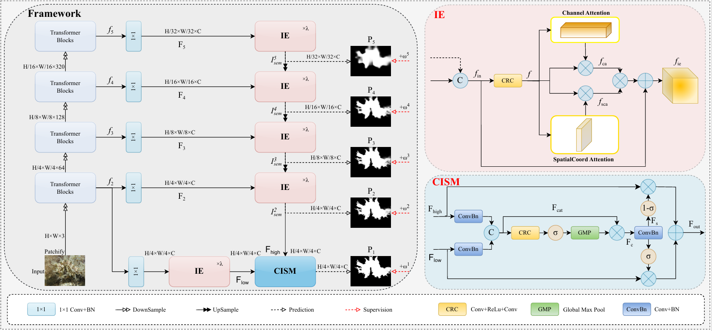
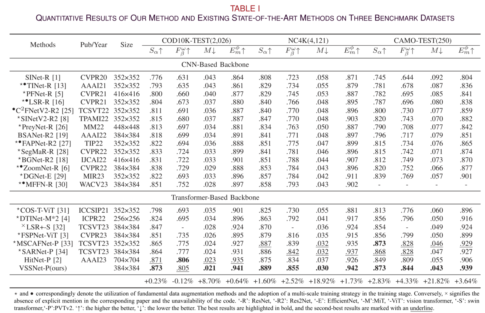
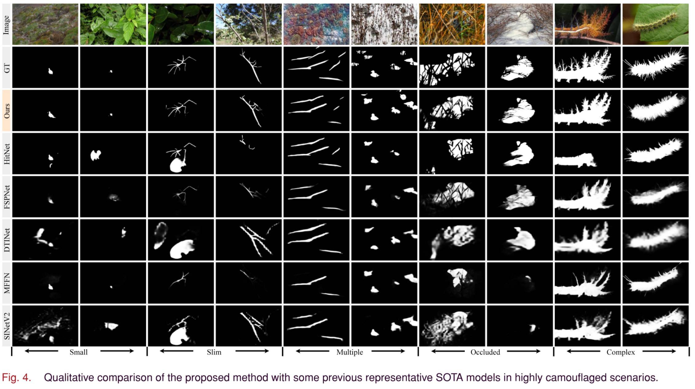
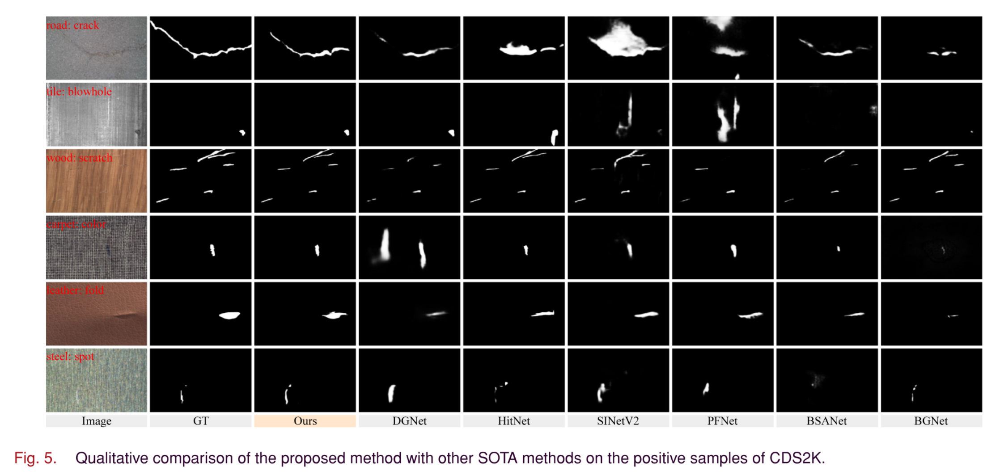

# Camouflaged Object Detection via Complementary Information-Selected Network based on Visual and Semantic Separation




# 1. Abstract

> Camouflaged Object Detection (COD) is a promising yet challenging task that aims to segment objects concealed within intricate surroundings. Current COD methods primarily focus on the direct fusion of high-level and low-level information, without considering the differences and inconsistencies between them. Therefore, accurately segmenting highly camouflaged objects in challenging scenarios presents a considerable problem. To mitigate this issue, we propose a novel framework called Visual and Semantic Separation Network (VSSNet), which separately extracts low-level visual perception knowledge and high-level semantic cues of camouflaged objects, and adaptively selects them to achieve more accurate predictions. Specifically, we employ the Information Extractor (IE) module to capture dimension-aware visual or semantic information, enabling the perception of camouflaged objects from various perspectives. Subsequently, the approach incorporates Complementary Information-Selected Module (CISM) to leverage the complementary nature of visual and semantic information for adaptively selecting and combining them. Additionally, we design a hard weighting strategy called Region Disparity Weighting (RDW) to encourage the model to focus more on the boundaries of highly camouflaged and difficult-to-predict objects. The experimental results on benchmark datasets demonstrate that our method significantly outperforms existing state-of-the-art COD methods, even without any data augmentations and multi-scale training techniques. 


# 2. Results








# 3. Preparations

## 3.1 Datasets


## 3.2 Create and activate conda environment

```bash
conda create -n VSSNet python=3.8
conda activate VSSNet

git clone https://github.com/ycyinchao/VSSNet.git
cd VSSNet

pip install -r requirement.txt
```


## 3.3 Download Pre-trained weights

The pretrained model is stored in [Google Drive](https://drive.google.com/file/d/1rKmp0Zu1ZL6Z9VsYfYAKRkG271AvZB6G/view?usp=sharing). After downloading, please put it in the './pretrained/' fold.


## 3.4 Train

```bash
python Train.py --train_path 'the path of TrainDataset' --test_path 'the path of TestDataset'
```

Our well-trained model is stored in [Google Drive](https://drive.google.com/file/d/1_iqEtc5VvhYSk5PSdyuFDsMdb7GlwdJo/view?usp=sharing), which should be moved into the fold './checkpoints/VSSNet_384/'.


## 3.5 Test

```bash
python MyTesting.py --pth_path 'the path of checkpoint'
```

The more qualitative results of VSSNet on four benchmarks (COD10K, NC4K, CAMO, CHAMELEON) have already been stored in [Google Drive](https://drive.google.com/file/d/1RV12SAH93VbAvrOw7zghJUgMrrklihj8/view?usp=sharing), please unzip it into the fold './results/'.


## 3.6 Eval

```bash
python test_metrics.py
```

the results of evaluation are also in [Google Drive](https://drive.google.com/file/d/1RV12SAH93VbAvrOw7zghJUgMrrklihj8/view?usp=sharing).


# 4. Citation

Please kindly cite our paper if you find it's helpful in your work.

```
@article{yin2024camouflaged,
  title={Camouflaged Object Detection via Complementary Information-Selected Network Based on Visual and Semantic Separation},
  author={Yin, Chao and Yang, Kequan and Li, Jide and Li, Xiaoqiang and Wu, Yifan},
  journal={IEEE Transactions on Industrial Informatics},
  year={2024},
  publisher={IEEE}
}
```


# 5. License

The source code is free for research and education use only. Any commercial use should get formal permission first.

